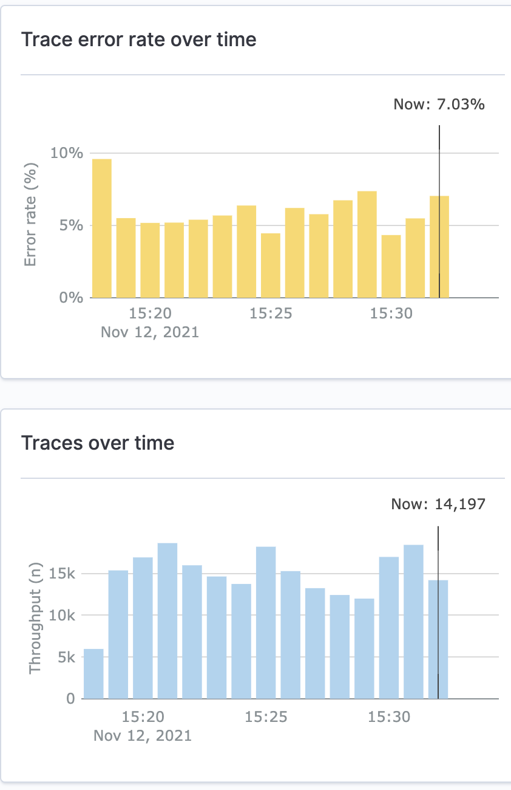

### Building a distributed tracing pipeline with open telemetry collector, data prepper and open search trace analytics

Over the past few years, the importance of observability when developing and managing applications has spiked as the usage of micro-services, service mesh has come into play. Distributed services can be unpredictable and despite our best efforts, failures and performance bottlenecks in such systems are inevitable—​and can be difficult to isolate. In such an environment, having deep visibility into the behavior of your applications is critical for software development teams.

The landscape for the observability continues to grow as we speak. In particular, when it comes to metrics, error logging and distributed traces; these can provide valuable information to optimize performance, troubleshoot application issues and make the service more stable. So it makes sense to create a distributed tracing pipeline to ingest, process and vizualize tracing data. 

At Dow Jones, we started a similar journey as we move our applications and micro services to our next generation service mesh based on EKS and istio. The requirement was to build a pipeline that would work for our micro service but also more legacy applications. With the public release of open telemetry, the path to build a standard tracing pipeline became possible. 
Attending the CNCF hosted kubecon this year (virtually) and went through some amazing talks, it became even more apparant the interest/importance in observability has picked up. With jaeger being CNCF graduated and open telemetry CNCF incubating already these are great tools to ingest, visualize your traces. 

Within dow jones, we have been working hard on building our next generation PAAS for our products. With our partnership with AWS, we have build our istio/EKS based service mesh for applications. With this model it was important to also move to a full observability suite for application metrics, trace and logs. 

#### Tracing Pipeline components 

#### What ?

We picked :
- open telemetry for creation, ingestion and processing trace data. 
- AWS opensearch (formerly elastic search) as the sink for the traces 
- data prepper and jaeger collector to process open telemetry trace data and export it to open search in formats that both kibana and jaeger understand. (This should go away soon as both jaeger and AWS kibana will natively be able to use otlp traces)
- Kibana and Jaeger to vizualize/query/dashboard on top of the trace data to get value from it

#### Why ? 


With open telemetry going GA and AWS open sources data prepper for AWS open search(elastic search) we have major components in place to setup a distributed tracing pipeline for our PAAS. OpenTelemetry (OTEL) was formed by the merging of OpenTracing and OpenCensus. Currently a CNCF sandbox project and its second most active in terms of contributions – Kubernetes being the first –, OTEL since its inception aimed to offer a single set of APIs and libraries that standardise how you collect and transfer telemetry data.

We really liked jaeger with its community engagement and helping track and measure requests and transactions by analyzing end-to-end data from service call chains so they can better understand latency issues in microservice architectures. What became sort of a gap for us though was to get a more holistic picture of all our applications inside the service mesh ; almost a histogram of metrics for microservices. It would be nice to know of the applications which have the highest error rate within our tech suite, micro services with the highest throughput. provides at-a-glance visibility into your application performance, along with the ability to drill down on individual traces.

This is where opensearch (fork on elastic search) comes into place. AWS had just open sourced data-prepper for AWS open search(elastic search) which serves as a sink for jaeger. Additonaly it comes with a manged offering of kibana. Data prepper helps with processing open telemtry traces and formatting them to kibana standards and pushing them to open search. Once AWS launched trace analytics this plugged in the gap for us to get a holistic picture across microservices in our fleet. With the ability to have multi exporters for open telemetry alongside some tail based sampling, we decided to send our traces to open search with different index patterns for jaeger and kibana and let the devs use what they like the best for their use case. 



The rest of the work is to get these components play nice with each others. With it being straightforward to export telemetry to multiple backend with open telemetry, it becomes pretty simple to export. The only roadblock at this juncture is the formatting that is required on the trace data coming out of open telemetry so that tools such as jaeger and trace analytics plugin can understand the data and vizualize it. This is soon to go away as both the tools work to natively consume open telmetry data and no need for server side formatting ir required.  


#### Architecture

In a nutshell the final production setup for this pipelines looks like so. Applications running in cluster or otherwise use open telemetry libraries/API to instrument traces and send it to open telemetry agents. We have open telemetry agents running as daemonset to batch and send traces from microservices to the opne telemetry collectors. This step can be skipped if you have much more simpler architectire and would rather just send traces straight to the open telemetry collector which is running as a deployment (horiznontally scalanble). The collectors sample the traces and export them to backends which in our case is data prepper and jaeger collector. These backends format and batch push the data to opensearch. Lastly, we have Trace Analytics pluign for Kibana and Jaeger vizualizing this data from open search and queried by our internal users. 


#### Breakdown 

##### Create traces

The first thing for a distributed tracing pipeline is to create/propagate traces. 

Open telemetry provides collection of tool such as API, SDK and integrates with popular languages and framework to integrate with greater OpenTelemetry ecosystem, such as OpenTelemetry Protocol (OTLP) and the OpenTelemetry Collector.

Open Telemetry provides a [status page](https://opentelemetry.io/status/) to keep track of its multiple tools as they go stable. It also provides for documentation on how to create distributed traces for your service both [manually or with auto instrumentation](https://opentelemetry.io/docs/concepts/instrumenting/) 

While this is out of scope for this blog, the documentation provided should get you started with creating standard traces within your service. 

##### Propagating traces

Once we have traces created for applications, it is important to be able to do context propagation to convert these traces to distributed traces. Context propagation facilitates the movement of context between services and processes. Context is injected into a request and extracted by a receiving service to parent new spans. That service may then make additional requests, and inject context to be sent to other services…and so on.

There are several protocols for context propagation that OpenTelemetry recognizes.

- [W3C Trace-Context HTTP Propagator](https://w3c.github.io/trace-context/)
- [W3C Correlation-Context HTTP Propagator](https://w3c.github.io/correlation-context/)
- [B3 Zipkin HTTP Propagator](https://github.com/openzipkin/b3-propagation)

At dow jones, we operate our own istio based service mesh hosted on AWS EKS.  


##### Data Collection

The OpenTelemetry project facilitates the collection of telemetry data via the OpenTelemetry Collector. The OpenTelemetry Collector offers a vendor-agnostic implementation on how to receive, process, and export telemetry data. It removes the need to run, operate, and maintain multiple agents/collectors in order to support open-source observability data formats (e.g. Jaeger, Prometheus, etc.) sending to one or more open-source or commercial back-ends. In addition, the Collector gives end-users control of their data. The Collector is the default location instrumentation libraries export their telemetry data.


[Open Telemetry Collector](https://opentelemetry.io/docs/collector/) offers a vendor-agnostic implementation of how to receive, process and export telemetry data. It removes the need to run, operate, and maintain multiple agents/collectors. This works with improved scalability and supports open-source observability data formats (e.g. Jaeger, Prometheus, Fluent Bit, etc.) sending to one or more open-source or commercial back-ends. The local Collector agent is the default location to which instrumentation libraries export their telemetry data.


###### OpenTelemetry Agents
We have open telemetry agents deployed as daemonset to recieve and batch ship traces from every EKS worker node. Agent is capable of receiving telemetry data (push and pull based) as well as enhancing telemetry data with metadata such as custom tags or infrastructure information. In addition, the Agent can offload responsibilities that client instrumentation would otherwise need to handle including batching, retry, encryption, compression and more. 


<details>
  <summary>OpenTelemetry-Agent.yaml</summary>

```yaml
---
apiVersion: v1
kind: ConfigMap
metadata:
  name: otel-agent-conf
  namespace: tracing
  labels:
    app: opentelemetry
    component: otel-agent-conf
data:
  otel-agent-config: |
    receivers:
      otlp:
        protocols:
          grpc:
          http:
    exporters:
      otlp:
        endpoint: "otel-collector.tracing:4317" 
        tls:
          insecure: true
        sending_queue:
          num_consumers: 20
          queue_size: 10000
        retry_on_failure:
          enabled: true
      loadbalancing:
        protocol:
          otlp:
            # all options from the OTLP exporter are supported
            # except the endpoint
            tls:
              insecure: true
            sending_queue:
              num_consumers: 20
              queue_size: 10000
            retry_on_failure:
              enabled: true
        resolver:
          dns:
            hostname: otel-collector.tracing
            port: 4317
    processors:
      resource:
        attributes:
        - key: k8s.cluster.region
          value: "region-name"
          action: insert
        - key: k8s.cluster.name
          value: "cluster-name"
          action: insert
        - key: k8s.cluster.env
          value: "environment-name"
          action: insert
      # The resource detector injects the pod IP
      # to every metric so that the k8sattributes can
      # fetch information afterwards.
      resourcedetection:
        detectors: ["eks"]
        timeout: 5s
        override: true
      memory_limiter:
        check_interval: 1s
        limit_percentage: 50
        spike_limit_percentage: 30
    extensions:
      memory_ballast:
        size_in_percentage: 20
    service:
      pipelines:
        traces/1:
          receivers: [otlp]
          processors: [memory_limiter, batch, resourcedetection, resource]
          exporters: [loadbalancing]
---
apiVersion: apps/v1
kind: DaemonSet
metadata:
  name: otel-agent
  namespace: tracing
  labels:
    app: opentelemetry
    component: otel-agent
spec:
  selector:
    matchLabels:
      app: opentelemetry
      component: otel-agent
  template:
    metadata:
      annotations:
        prometheus.io/scrape: "true"
        prometheus.io/port: "8888"
        prometheus.io/path: "/metrics"
      labels:
        app: opentelemetry
        component: otel-agent
    spec:
      containers:
      - command:
          - "/otelcontribcol"
          - "--config=/conf/otel-agent-config.yaml"
        image: otel/opentelemetry-collector-contrib:0.37.1
        name: otel-agent
        env: 
        - name: POD_IP
          valueFrom:
            fieldRef:
              fieldPath: status.podIP
        # This is picked up by the resource detector
        - name: OTEL_RESOURCE
          value: "k8s.pod.ip=$(POD_IP)"
        resources:
          limits:
            cpu: 500m #TODO - adjust this to your own requirements
            memory: 500Mi #TODO - adjust this to your own requirements
          requests:
            cpu: 100m #TODO - adjust this to your own requirements
            memory: 100Mi #TODO - adjust this to your own requirements
        ports:
        - containerPort: 55680 # Default OpenTelemetry receiver port.
          hostPort: 55680
        - containerPort: 4317 # New OpenTelemetry receiver port.
          hostPort: 4317
        volumeMounts:
        - name: otel-agent-config-vol
          mountPath: /conf
        livenessProbe:
          httpGet:
            path: /
            port: 13133 # Health Check extension default port.
        readinessProbe:
          httpGet:
            path: /
            port: 13133 # Health Check extension default port.
      volumes:
        - configMap:
            name: otel-agent-conf
            items:
              - key: otel-agent-config
                path: otel-agent-config.yaml
          name: otel-agent-config-vol
---
```

</details>

###### OpenTelemetry Gateway


These agents forward the telemetry data to an open telemetry collector gateway. A Gateway cluster runs as a standalone service and can offer advanced capabilities over the Agent including tail-based sampling. In addition, a Gateway cluster can limit the number of egress points required to send data as well as consolidate API token management. Each Collector instance in a Gateway cluster operates independently so it is easy to scale the architecture based on performance needs with a simple load balancer. We deploy gateway as a kubernetes deployment. 

For every EKS cluster we deploy agents per worker node (daemonset) and collector as a deployment. The agent is responsible for recieving the traces coming in from application and envoy proxy. It is responsible for adding metadata and batching/retrying to opne telemetry collector gateway. 


We use the [Tail Sampling Processor](https://github.com/open-telemetry/opentelemetry-collector-contrib/blob/main/processor/tailsamplingprocessor/README.md) which enabled us to make more intelligent choices when it comes to keeping traces. This is especially true for latency measurements, which can only be measured after they’re complete. Since the collector sits at the end of the the pipeline and has a complete picture of a distributed trace, sampling determinations are made in open telemetry collectors which decide to sample based on isolated, independent portions of the trace data.

## TODO  - talk about what kind of filtering do we do with our traces for tail based sampling

Today, this processor only works with a single instance of the collector. We utiltize the trace ID aware load balancing to support multiple collector instances as a single instance of collector doesnt cut it for the amount of trace data we generate. This adds another open telemetry gateway deployment between the agents and the tail sampling gateway collector. It is responsible for consistently exporting spans and logs belonging to the same trace to the same backend gateway collector so we can do tail based sampling.

<details>
  <summary>OpenTelemetry-Collector.yaml</summary>

```yaml
---
apiVersion: v1
kind: ConfigMap
metadata:
  name: otel-collector-conf
  namespace: tracing
  labels:
    app: opentelemetry
    component: otel-collector-conf
data:
  otel-collector-config: |
    receivers:
      otlp:
        protocols:
          grpc:
          http:
    processors:
      # This processor inspects spans looking for matching attributes.
      # Spans that DONT MATCH this will have a new attribute added named retain-span
      # This is then used by the tail_sampling processor to only export spans that
      # have the retain-span attribute.
      # All conditions have to match here to be excluded.
      attributes/filter_spans1:
        exclude:
          match_type: strict
          attributes:
            - {key: "foo", value: "bar"}
        actions:
          - key: retain-span
            action: insert
            value: "true"
      attributes/filter_spans2:
        include:
          match_type: regexp
          regexp:
            # cacheenabled determines whether match results are LRU cached to make subsequent matches faster.
            # Cache size is unlimited unless cachemaxnumentries is also specified.
            cacheenabled: true
          span_names: ["serviceA*"]
        actions:
          - key: retain-span
            action: update
            value: "false"
      # Any policy match will make the trace be sampled !, enable regex didnt caused nothing to match
      tail_sampling:
        decision_wait: 10s
        expected_new_traces_per_sec: 300
        policies:
          [   
            {
              name: policy-retain-span,
              type: string_attribute,
              string_attribute: {key: retain-span, values: ['true']}
            },
            {
            name: rate-limiting-policy,
            type: rate_limiting,
            rate_limiting: {spans_per_second: 35}
            },
            {
            name: probabilistic-sampling,
            type: probabilistic,
            probabilistic: {sampling_percentage: 50}
            }
          ]
      # The k8sattributes in the Agent is in passthrough mode
      # so that it only tags with the minimal info for the
      # collector k8sattributes to complete
      k8sattributes:
        passthrough: true
      memory_limiter:
        check_interval: 1s
        limit_percentage: 50
        spike_limit_percentage: 30
    extensions:
      memory_ballast:
        size_in_percentage: 20
    exporters:
      logging:
        loglevel: info
      otlp/data-prepper:
        endpoint: data-prepper-headless:21890
        tls:
          insecure: true
      jaeger:
        endpoint: "http://jaeger-collector.tracing.svc.cluster.local:14250"
        tls:
          insecure: true
    service:
      pipelines:
        traces/1:
          receivers: [otlp]
          processors: [memory_limiter, k8sattributes, attributes/filter_spans1, attributes/filter_spans2, tail_sampling]
          exporters: [jaeger, otlp/data-prepper]
---
apiVersion: v1
kind: Service
metadata:
  name: otel-collector
  namespace: tracing
  labels:
    app: opentelemetry
    component: otel-collector
spec:
  ports:
  - name: otlp # Default endpoint for OpenTelemetry receiver.
    port: 55680
    protocol: TCP
    targetPort: 55680
  - name: grpc-otlp # New endpoint for OpenTelemetry receiver.
    port: 4317
    protocol: TCP
    targetPort: 4317
  - name: metrics # Default endpoint for querying metrics.
    port: 8888
  selector:
    component: otel-collector
---
apiVersion: apps/v1
kind: Deployment
metadata:
  name: otel-collector
  namespace: tracing
  labels:
    app: opentelemetry
    component: otel-collector
spec:
  selector:
    matchLabels:
      app: opentelemetry
      component: otel-collector
  minReadySeconds: 5
  progressDeadlineSeconds: 120
  replicas: 4 #TODO - adjust this to your own requirements
  template:
    metadata:
      annotations:
        prometheus.io/scrape: "true"
        prometheus.io/port: "8888"
        prometheus.io/path: "/metrics"
      labels:
        app: opentelemetry
        component: otel-collector
    spec:
      containers:
      - command:
          - "/otelcontribcol"
          - "--log-level=debug"
          - "--config=/conf/otel-collector-config.yaml"
        image: otel/opentelemetry-collector-contrib:0.37.1
        name: otel-collector
        resources:
          limits:
            cpu: 2 #TODO - adjust this to your own requirements
            memory: 4Gi #TODO - adjust this to your own requirements
          requests:
            cpu: 1 #TODO - adjust this to your own requirements
            memory: 2Gi #TODO - adjust this to your own requirements
        ports:
        - containerPort: 55680 # Default endpoint for OpenTelemetry receiver.
        - containerPort: 4317 # Default endpoint for OpenTelemetry receiver.
        - containerPort: 8888  # Default endpoint for querying metrics.
        volumeMounts:
        - name: otel-collector-config-vol
          mountPath: /conf
        livenessProbe:
          httpGet:
            path: /
            port: 13133 # Health Check extension default port.
        readinessProbe:
          httpGet:
            path: /
            port: 13133 # Health Check extension default port.
      volumes:
        - configMap:
            name: otel-collector-conf
            items:
              - key: otel-collector-config
                path: otel-collector-config.yaml
          name: otel-collector-config-vol
---
```
</details>

##### Formatting and Exporting Traces 

We now have distributed traces created, context propagated and sampled using tail based sampling. All that is left now is to format the trace data in a way that our query engine can undersdtand it. At dowjones we use both Jaeger and Trace Analytics Kibana to query and vizualize this data because of certain gaps they fill for each other. With open telemetry we can push the data to two different backends from the same collector. Today, both [Trace Analytics OpenSearch Dashboards plugin](https://opensearch.org/docs/monitoring-plugins/trace/ta-dashboards/) and [Jaeger]() needs open telemetry data to be transformed to be able to vizualize it. This is why we need a last mile server-side component :

- JAeger Collector : To transform data for jaeger 
- Data PRepper : To tranform this data for Trace Analytics OpenSearch Dashboards plugin


- Jaeger Collector :

To vizualize disributed traces through jaeger query, we need to transform these traces to jaeger style traces and then use jaeger collector to ship them to a sink, in our case opensearch (formerly known as AWS managed elasticsearch)

<details>
  <summary>Jaeger-Collector.yaml</summary>

```yaml
# All operations of service foo are sampled with probability 0.8 except for operations op1 and op2 which are probabilistically sampled with probabilities 0.2 and 0.4 respectively.
# All operations for service bar are rate-limited at 5 traces per second.
# Any other service will be sampled with probability 1 defined by the default_strategy.

provisionDataStore:
  cassandra: false
storage:
  type: elasticsearch
  elasticsearch:
    scheme: https
    usePassword: false
    host: "opensearch-arn.us-east-1.es.amazonaws.com"
    port: "443"

tag: 1.22.0

agent:
  enabled: false

collector:
  autoscaling:
    enabled: true
    targetMemoryUtilizationPercentage: 80
  service:
  serviceAccount:
    name: jaeger
  samplingConfig: |-
    {
      "service_strategies": [
        {
          "service": "foo",
          "type": "probabilistic",
          "param": 0.8
        },
        {
          "service": "bar",
          "type": "ratelimiting",
          "param": 5
        }
      ],
      "default_strategy": {
        "type": "probabilistic",
        "param": 1.0
      }
    }

query:
  enabled: false

```
</details>
- Data prepper 

To vizualize disributed traces through jaeger kibana, we need to transform these traces to kibana style traces and then use data prepper to ship them to a sink, in our case opensearch (formerly known as AWS managed elasticsearch)

<details>
  <summary>Data-Prepper.yaml</summary>

```yaml
apiVersion: v1
kind: ConfigMap
metadata:
  namespace: tracing
  labels:
    app: data-prepper
  name: data-prepper-config
data:
  pipelines.yaml: |
    entry-pipeline:
      workers : 8
      delay: "100"
      buffer:
        bounded_blocking:
          # buffer_size is the number of ExportTraceRequest from otel-collector the data prepper should hold in memeory. 
          # We recommend to keep the same buffer_size for all pipelines. 
          # Make sure you configure sufficient heap
          # default value is 512
          buffer_size: 4096
          # This is the maximum number of request each worker thread will process within the delay.
          # Default is 8.
          # Make sure buffer_size >= workers * batch_size
          batch_size: 512
      source:
        otel_trace_source:
          health_check_service: true
          ssl: false
      prepper:
        - peer_forwarder:
            discovery_mode: "dns"
            domain_name: "data-prepper-headless"
            ssl: false
      sink:
        - pipeline:
            name: "raw-pipeline"
        - pipeline:
            name: "service-map-pipeline"
    raw-pipeline:
      workers : 8
      buffer:
        bounded_blocking:
          # Configure the same value as in otel-trace-pipeline
          # Make sure you configure sufficient heap
          # default value is 512
          buffer_size: 4096
          # The raw prepper does bulk request to your elasticsearch sink, so configure the batch_size higher.
          # If you use the recommended otel-collector setup each ExportTraceRequest could contain max 50 spans. https://github.com/opendistro-for-elasticsearch/data-prepper/tree/v0.7.x/deployment/aws
          # With 64 as batch size each worker thread could process upto 3200 spans (64 * 50)
          batch_size: 512
      source:
        pipeline:
          name: "entry-pipeline"
      prepper:
        - otel_trace_raw_prepper:
      sink:
        - elasticsearch:
            hosts: 
              - "https://opensearch-arn.us-east-1.es.amazonaws.com"
            insecure: true
            # putting aws_sigv4: false causes auth issues (TBFixed)
            aws_sigv4: false 
            aws_region: "region-name"
            trace_analytics_raw: true
    service-map-pipeline:
      workers : 1
      delay: "100"
      source:
        pipeline:
          name: "entry-pipeline"
      prepper:
        - service_map_stateful:
      buffer:
        bounded_blocking:
          # buffer_size is the number of ExportTraceRequest from otel-collector the data prepper should hold in memeory. 
          # We recommend to keep the same buffer_size for all pipelines. 
          # Make sure you configure sufficient heap
          # default value is 512
          buffer_size: 512
          # This is the maximum number of request each worker thread will process within the delay.
          # Default is 8.
          # Make sure buffer_size >= workers * batch_size
          batch_size: 8
      sink:
        - elasticsearch:
            hosts: 
              - "https://opensearch-arn.us-east-1.es.amazonaws.com"
            insecure: true
            # putting aws_sigv4: false causes auth issues (TBFixed)
            aws_sigv4: false 
            aws_region: "region-name"
            trace_analytics_service_map: true
  data-prepper-config.yaml: |
    ssl: false
---
apiVersion: v1
kind: Service
metadata:
  namespace: tracing
  labels:
    app: data-prepper
  name: data-prepper-headless
spec:
  clusterIP: None
  ports:
    - name: "21890"
      port: 21890
      targetPort: 21890
  selector:
    app: data-prepper
---
apiVersion: v1
kind: Service
metadata:
  namespace: tracing
  labels:
    app: data-prepper
  name: data-prepper-metrics
spec:
  type: NodePort
  ports:
    - name: "4900"
      port: 4900
      targetPort: 4900
  selector:
    app: data-prepper
---
apiVersion: apps/v1
kind: Deployment
metadata:
  namespace: tracing
  labels:
    app: data-prepper
  name: data-prepper
spec:
  replicas: 4
  selector:
    matchLabels:
      app: data-prepper
  strategy:
    type: Recreate
  template:
    metadata:
      annotations:
        prometheus.io/scrape: "true"
        prometheus.io/port: "4900"
        prometheus.io/path: "/metrics"
        sidecar.istio.io/inject: "false"
      labels:
        app: data-prepper
    spec:
      containers:
        - args:
            - java
            - -jar
            - /usr/share/data-prepper/data-prepper.jar
            - /etc/data-prepper/pipelines.yaml
            - /etc/data-prepper/data-prepper-config.yaml
            - -Dlog4j.configurationFile=config/log4j2.properties
          image: amazon/opendistro-for-elasticsearch-data-prepper:1.0.0
          imagePullPolicy: IfNotPresent
          name: data-prepper
          resources:
            limits:
              cpu: 1
              memory: 2Gi
            requests:
              cpu: 200m
              memory: 400Mi
          ports:
            - containerPort: 21890
          volumeMounts:
            - mountPath: /etc/data-prepper
              name: prepper-configmap-claim0
            - mountPath: config
              name: prepper-log4j2
      restartPolicy: Always
      volumes:
        - name: prepper-configmap-claim0
          configMap:
            name: data-prepper-config
        - name: prepper-log4j2
          configMap:
            name: data-prepper-log4j2
---
apiVersion: v1
kind: ConfigMap
metadata:
  namespace: tracing
  labels:
    app: data-prepper
  name: data-prepper-log4j2
data:
  log4j2.properties: |
    status = error
    dest = err
    name = PropertiesConfig
    
    property.filename = log/data-prepper/data-prepper.log
    
    appender.console.type = Console
    appender.console.name = STDOUT
    appender.console.layout.type = PatternLayout
    appender.console.layout.pattern = %d{ISO8601} [%t] %-5p %40C - %m%n
    
    rootLogger.level = warn
    rootLogger.appenderRef.stdout.ref = STDOUT

    logger.pipeline.name = com.amazon.dataprepper.pipeline
    logger.pipeline.level = info

    logger.parser.name = com.amazon.dataprepper.parser
    logger.parser.level = info

    logger.plugins.name = com.amazon.dataprepper.plugins
    logger.plugins.level = info
---

```
</details>

##### Vizualization 

If you have reached this point, then you now have distributed traces created, context propagated and sampled using tail based sampling, tranformed for consumption by our vizualization tools and exported to opensearch under different index patterns. 

Now we can bear the gifts of diftributed traces and vizualize these traces to run queries, build dashboard, setup alerting. While Trace Analytics OpenSearch Dashboards plugin is a managed kibana plugin that comes with open search, we host our own [Jaeger Frontend/UI](https://www.jaegertracing.io/docs/1.28/frontend-ui/) which provides a simple jaeger UI to query for distributed traces with Traces View
and Traces Detail View. We deployer JAeger Query as a deployment within the EKS cluster. Its deployed as a helm chart. 


- JAeger query 

To vizualize your traces with jaeger we need to run a jaeger query :

<details>
  <summary>Jaeger-Query.yaml</summary>

```yaml
# All operations of service foo are sampled with probability 0.8 except for operations op1 and op2 which are probabilistically sampled with probabilities 0.2 and 0.4 respectively.
# All operations for service bar are rate-limited at 5 traces per second.
# Any other service will be sampled with probability 1 defined by the default_strategy.

provisionDataStore:
  cassandra: false
storage:
  type: elasticsearch
  elasticsearch:
    scheme: https
    usePassword: false
    host: "opensearch-arn.us-east-1.es.amazonaws.com"
    port: "443"

tag: 1.22.0

agent:
  enabled: false

collector:
  enabled: false

query:
  enabled: true
  agentSidecar:
    enabled: false
  service:
    type: LoadBalancer
    port: 443
    annotations:
      service.beta.kubernetes.io/aws-load-balancer-ssl-cert: ""
      service.beta.kubernetes.io/aws-load-balancer-internal: 0.0.0.0/0
  config: |-
    {
      "dependencies": {
        "dagMaxNumServices": 200,
        "menuEnabled": true
      },
      "menu": [
    {
      "label": "Open Telemetry Resources",
      "items": [
        {
          "label": "Open Telemetry Client Instrumentation",
          "url": "https://opentelemetry.io/docs/"
        }
          ]
        }
      ],
      "archiveEnabled": true,
      "search": {
        "maxLookback": {
          "label": "7 Days",
          "value": "7d"
        },
        "maxLimit": 1500
      }
    }

spark:
  enabled: false

esIndexCleaner:
  enabled: false

esRollover:
  enabled: false

esLookback:
  enabled: false

```
</details>

- Kibana 

AWS managed opensearch comes with a manged kibana to vizualize the traces. Open search recently released Trace analtyics which mirrors elasticsearch trace analtyics and gives a holistic picture of all the traces.. Great article : https://aws.amazon.com/blogs/big-data/getting-started-with-trace-analytics-in-amazon-elasticsearch-service/
